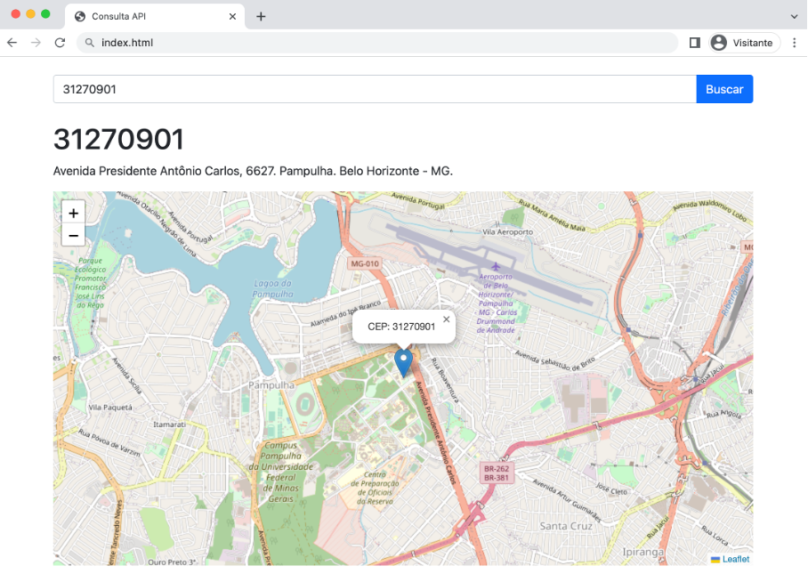

# front-end da api de consulta ao cep
Este código apresenta uma função usada para realizar consultas de CEP por meio do back-end.

As requisições são feitas de forma assíncrona usando o objeto XMLHttpRequest (XHR).

-  *Entrada*: oito dígitos de um CEP
-  *Saída*: Retorna o endereço correspondente em um objeto JSON

*Configurações devem ser definidas no arquivo*: script.js

## Avançado
O código inclui ainda uma função para gerar mapas usando a biblioteca [Leaflet](https://leafletjs.com/).

## Exemplo
